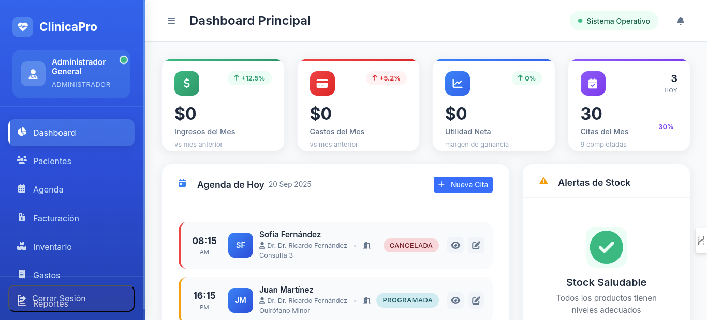
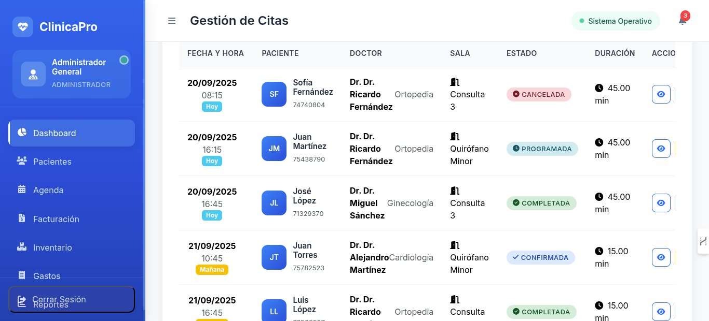
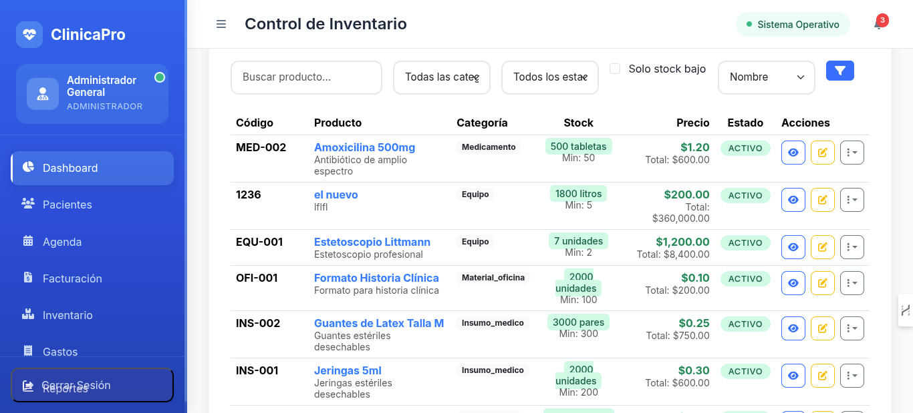

# Sistema de Gestión Clínica 🏥

[](https://laravel.com)
[](https://php.net)
[](https://mysql.com)
[](LICENSE)

Sistema integral de gestión clínica desarrollado con Laravel que permite administrar de manera eficiente todas las operaciones de un centro médico, desde la programación de citas hasta la facturación y control de inventario.

## 🚀 Características Principales

### 👥 Gestión de Usuarios Multi-Rol
- **Administrador**: Control total del sistema y configuraciones
- **Contador**: Gestión financiera, gastos y reportes contables
- **Recepcionista**: Manejo de citas, pacientes y atención al cliente

### 📅 Sistema de Citas Médicas
- **Programación inteligente** con detección de conflictos
- **Estados de cita**: Programada, Confirmada, En Curso, Completada, Cancelada
- **Asignación automática** de consultorios y doctores
- **Calendario visual** para mejor organización
- **Notificaciones** y recordatorios automáticos

### 🩺 Gestión de Pacientes
- **Expedientes digitales** completos
- **Historial médico** detallado
- **Información de contacto** y demografía
- **Notas médicas** y observaciones especiales
- **Búsqueda avanzada** y filtros

### 👨‍⚕️ Administración de Personal Médico
- **Base de datos de doctores** con especialidades
- **Horarios y disponibilidad**
- **Número de cédula profesional**
- **Estadísticas de desempeño**

### 🏥 Gestión de Consultorios
- **Administración de salas** de consulta
- **Control de disponibilidad** en tiempo real
- **Asignación automática** según horarios

### 💊 Control de Inventario
- **Gestión completa de medicamentos** e insumos médicos
- **Control de stock** con alertas de nivel mínimo
- **Movimientos de entrada y salida**
- **Categorización** por tipo de producto
- **Reportes de consumo** y costos

### 🧾 Sistema de Facturación
- **Facturación electrónica** automática
- **Múltiples servicios médicos** por factura
- **Integración con inventario** para productos vendidos
- **Control de pagos** y estados
- **Generación de reportes** financieros

### 💰 Control de Gastos
- **Registro detallado** de todos los gastos
- **Categorización** por tipo de gasto
- **Proveedores** y métodos de pago
- **Reportes financieros** por período
- **Dashboard** con métricas clave

### 📊 Dashboard Inteligente
- **Métricas en tiempo real** del negocio
- **Gráficos interactivos** de rendimiento
- **Alertas** de stock bajo e inventario crítico
- **Resumen financiero** mensual
- **Citas del día** y próximas

## 🛠️ Tecnologías Utilizadas

- **Backend**: Laravel 11.x con PHP 8.2+
- **Base de Datos**: MySQL 8.0+
- **Frontend**: Blade Templates + Bootstrap/Tailwind
- **Autenticación**: Laravel Auth con roles
- **UUID**: Identificadores únicos para seguridad
- **Migraciones**: Control de versiones de BD
- **Seeders**: Datos de prueba y configuración inicial

## 📋 Requisitos del Sistema

### Requisitos Mínimos
- PHP 8.2 o superior
- Composer 2.0+
- MySQL 8.0+ o MariaDB 10.3+
- Node.js 18+ (para assets)
- Servidor web (Apache/Nginx)

### Extensiones PHP Requeridas
- OpenSSL
- PDO
- Mbstring
- Tokenizer
- XML
- Ctype
- JSON
- BCMath

## ⚡ Instalación Rápida

### 1. Clonar el Repositorio
```bash
git clone https://github.com/tu-usuario/sistema-clinica.git
cd sistema-clinica
```

### 2. Instalar Dependencias
```bash
composer install
npm install
```

### 3. Configurar Entorno
```bash
cp .env.example .env
php artisan key:generate
```

### 4. Configurar Base de Datos
Edita el archivo `.env` con tus credenciales:
```env
DB_CONNECTION=mysql
DB_HOST=127.0.0.1
DB_PORT=3306
DB_DATABASE=clinica_db
DB_USERNAME=tu_usuario
DB_PASSWORD=tu_contraseña
```

### 5. Ejecutar Migraciones y Seeders
```bash
php artisan migrate --seed
```

### 6. Compilar Assets
```bash
npm run build
```

### 7. Iniciar Servidor
```bash
php artisan serve
```

El sistema estará disponible en: `http://localhost:8000`

## 🔐 Credenciales de Acceso por Defecto

### Administrador
- **Email**: admin@clinica.com
- **Contraseña**: password123
- **Rol**: Administrador

### Contador
- **Email**: contador@clinica.com
- **Contraseña**: password123
- **Rol**: Contador

### Recepcionista
- **Email**: recepcion@clinica.com
- **Contraseña**: password123
- **Rol**: Recepcionista

## 🗂️ Estructura del Proyecto

```
sistema-clinica/
├── app/
│   ├── Http/Controllers/
│   │   ├── AppointmentController.php      # Gestión de citas
│   │   ├── PatientController.php          # Gestión de pacientes
│   │   ├── DoctorController.php           # Gestión de doctores
│   │   ├── InvoiceController.php          # Sistema de facturación
│   │   ├── InventoryController.php        # Control de inventario
│   │   ├── ExpenseController.php          # Control de gastos
│   │   └── DashboardController.php        # Dashboard principal
│   └── Models/
│       ├── User.php                       # Usuarios del sistema
│       ├── Patient.php                    # Pacientes
│       ├── Doctor.php                     # Doctores
│       ├── Appointment.php                # Citas médicas
│       ├── Invoice.php                    # Facturas
│       ├── InventoryItem.php              # Productos de inventario
│       └── Expense.php                    # Gastos
├── database/
│   ├── migrations/                        # Migraciones de BD
│   └── seeders/                          # Datos de prueba
├── resources/
│   └── views/                            # Vistas Blade
├── routes/
│   └── web.php                           # Rutas del sistema
└── public/                               # Assets públicos
```

## 📚 Funcionalidades Detalladas

### Sistema de Citas
```php
// Crear nueva cita
POST /appointments
{
    "patient_id": "uuid",
    "doctor_id": "uuid", 
    "consultation_room_id": "uuid",
    "scheduled_at": "2024-12-01 09:00:00",
    "duration_minutes": 30,
    "notes": "Consulta de control"
}
```

### Gestión de Pacientes
- **CRUD completo** de pacientes
- **Búsqueda** por nombre, teléfono, email, RFC
- **Filtros** por estado, género, etc.
- **Historial** de citas y facturas
- **Notas médicas** importantes

### Control de Inventario
- **Categorías**: Medicamentos, Insumos médicos, Material de oficina, Equipo
- **Alertas de stock bajo** automáticas
- **Movimientos** de entrada y salida rastreados
- **Usuarios responsables** de cada movimiento

### Sistema de Facturación
- **Servicios médicos** predefinidos
- **Productos de inventario** incluibles
- **Cálculo automático** de impuestos (16% IVA)
- **Estados**: Pendiente, Pagada, Cancelada
- **Métodos de pago**: Efectivo, Transferencia, Crédito

## 🎯 Casos de Uso Principales

### Flujo de Atención al Paciente
1. **Recepcionista** registra nuevo paciente
2. **Recepcionista** programa cita con doctor disponible
3. **Doctor** atiende y actualiza estado de cita
4. **Sistema** genera factura automáticamente
5. **Recepcionista** procesa pago y entrega comprobante

### Gestión de Inventario
1. **Administrador** registra nuevos productos
2. **Personal** registra movimientos de entrada/salida
3. **Sistema** alerta cuando stock está bajo
4. **Administrador** genera órdenes de compra
5. **Sistema** actualiza costos y valores

### Control Financiero
1. **Contador** registra gastos diarios
2. **Sistema** categoriza automáticamente
3. **Dashboard** muestra métricas en tiempo real
4. **Contador** genera reportes mensuales
5. **Administrador** toma decisiones basadas en datos

## 📊 Reportes y Analíticas

### Dashboard Principal
- **Ingresos vs Gastos** del mes actual
- **Citas programadas** hoy y próximos días
- **Stock crítico** y productos por reabastecer
- **Pacientes atendidos** en el período
- **Doctores con mayor actividad**

### Reportes Disponibles
- **Reporte financiero** mensual/anual
- **Estadísticas de citas** por doctor/período
- **Análisis de inventario** y rotación
- **Pacientes frecuentes** y demografía
- **Gastos por categoría** y proveedor

## 🔧 Configuración Avanzada

### Variables de Entorno Importantes

```env
# Aplicación
APP_NAME="Sistema Clínica"
APP_ENV=production
APP_DEBUG=false
APP_URL=https://tu-clinica.com

# Base de Datos
DB_CONNECTION=mysql
DB_HOST=localhost
DB_PORT=3306
DB_DATABASE=clinica_production
DB_USERNAME=clinica_user
DB_PASSWORD=password_seguro

# Mail (para notificaciones)
MAIL_MAILER=smtp
MAIL_HOST=smtp.gmail.com
MAIL_PORT=587
MAIL_USERNAME=tu-email@gmail.com
MAIL_PASSWORD=tu-password
MAIL_ENCRYPTION=tls

# Configuraciones del Sistema
CLINIC_NAME="Mi Clínica"
CLINIC_ADDRESS="Dirección de la clínica"
CLINIC_PHONE="(555) 123-4567"
CLINIC_EMAIL="info@miclinica.com"
```

### Personalización de Roles
```php
// En User.php
public function hasRole($role)
{
    return $this->role === $role;
}

public function canManageInventory()
{
    return in_array($this->role, ['administrador', 'contador']);
}

public function canViewReports()
{
    return in_array($this->role, ['administrador', 'contador']);
}
```

## 🚀 Deployment en Producción

### Configuración del Servidor

```bash
# Instalar dependencias del servidor
sudo apt update
sudo apt install nginx mysql-server php8.2-fpm php8.2-mysql

# Configurar Nginx
sudo nano /etc/nginx/sites-available/clinica

# Contenido del archivo Nginx
server {
    listen 80;
    server_name tu-clinica.com;
    root /var/www/clinica/public;
    
    add_header X-Frame-Options "SAMEORIGIN";
    add_header X-Content-Type-Options "nosniff";
    
    index index.php;
    
    charset utf-8;
    
    location / {
        try_files $uri $uri/ /index.php?$query_string;
    }
    
    location = /favicon.ico { access_log off; log_not_found off; }
    location = /robots.txt  { access_log off; log_not_found off; }
    
    error_page 404 /index.php;
    
    location ~ \.php$ {
        fastcgi_pass unix:/var/run/php/php8.2-fpm.sock;
        fastcgi_param SCRIPT_FILENAME $realpath_root$fastcgi_script_name;
        include fastcgi_params;
    }
    
    location ~ /\.(?!well-known).* {
        deny all;
    }
}
```

### Optimización para Producción
```bash
# Optimizar autoload
composer install --optimize-autoloader --no-dev

# Optimizar configuración
php artisan config:cache
php artisan route:cache
php artisan view:cache

# Configurar permisos
sudo chown -R www-data:www-data /var/www/clinica
sudo chmod -R 755 /var/www/clinica
sudo chmod -R 775 /var/www/clinica/storage
sudo chmod -R 775 /var/www/clinica/bootstrap/cache
```

### Backup Automatizado
```bash
#!/bin/bash
# backup-clinica.sh

DATE=$(date +%Y%m%d_%H%M%S)
BACKUP_DIR="/backups/clinica"
DB_NAME="clinica_production"

# Crear backup de base de datos
mysqldump -u root -p $DB_NAME > $BACKUP_DIR/db_backup_$DATE.sql

# Crear backup de archivos
tar -czf $BACKUP_DIR/files_backup_$DATE.tar.gz /var/www/clinica

# Eliminar backups antiguos (más de 30 días)
find $BACKUP_DIR -name "*.sql" -mtime +30 -delete
find $BACKUP_DIR -name "*.tar.gz" -mtime +30 -delete
```

## 📱 Futuras Mejoras

### Funcionalidades Planificadas
- **App móvil** para médicos y pacientes
- **Telemedicina** integrada
- **Recordatorios SMS/WhatsApp** automáticos
- **Integración con laboratorios** externos
- **Sistema de expedientes** digitales completos
- **Reportes avanzados** con BI
- **API REST** para integraciones
- **Facturación electrónica** CFDI (México)

### Integraciones Disponibles
- **WhatsApp Business API** para notificaciones
- **Stripe/PayPal** para pagos en línea
- **Google Calendar** sincronización de citas
- **Zoom/Meet** para consultas virtuales

## 🧪 Testing

### Ejecutar Tests
```bash
# Tests unitarios
php artisan test

# Tests específicos
php artisan test --filter=AppointmentTest
php artisan test --filter=PatientTest

# Coverage
php artisan test --coverage
```

### Tests Implementados
- **AuthenticationTest**: Login y permisos
- **AppointmentTest**: CRUD y validaciones de citas
- **PatientTest**: Gestión de pacientes
- **InventoryTest**: Control de stock y movimientos
- **InvoiceTest**: Facturación y cálculos

## 🤝 Contribución

### Cómo Contribuir
1. Fork del proyecto
2. Crear rama feature (`git checkout -b feature/nueva-funcionalidad`)
3. Commit cambios (`git commit -am 'Agregar nueva funcionalidad'`)
4. Push a la rama (`git push origin feature/nueva-funcionalidad`)
5. Abrir Pull Request

### Estándares de Código
- Seguir **PSR-12** para PHP
- Usar **PHPDoc** para documentar métodos
- Escribir **tests** para nuevas funcionalidades
- Mantener **coverage** mínimo del 80%

## 📄 Licencia

Este proyecto está bajo la Licencia MIT. Ver [LICENSE](LICENSE) para más detalles.

## 🆘 Soporte

### Documentación
- [Manual de Usuario](docs/manual-usuario.pdf)
- [API Documentation](docs/api.md)
- [Guía de Instalación](docs/instalacion.md)

### Contacto
- **Email**: soporte@sistema-clinica.com
- **GitHub Issues**: [Reportar Problemas](https://github.com/tu-usuario/sistema-clinica/issues)
- **Documentación**: [Wiki del Proyecto](https://github.com/tu-usuario/sistema-clinica/wiki)

### FAQ

**P: ¿Cómo cambio la contraseña de un usuario?**
R: Los administradores pueden cambiar contraseñas desde el panel de usuarios.

**P: ¿Puedo personalizar los servicios médicos?**
R: Sí, desde el módulo de servicios médicos se pueden agregar, editar y gestionar todos los servicios.

**P: ¿Cómo genero reportes personalizados?**
R: El sistema incluye reportes predefinidos, pero se pueden crear reportes personalizados según necesidades específicas.

**P: ¿Es compatible con facturación electrónica?**
R: Actualmente soporta facturación básica. La integración con CFDI está en desarrollo.

---

## 🌟 Capturas de Pantalla

### Dashboard Principal


### Gestión de Citas


### Control de Inventario


---

⭐ **¡Dale una estrella al proyecto si te fue útil!**

Desarrollado con ❤️ para mejorar la gestión clínica